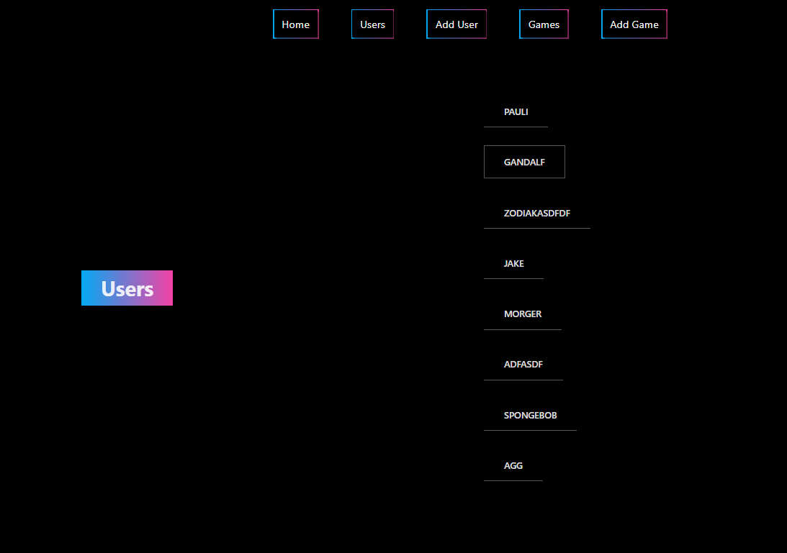
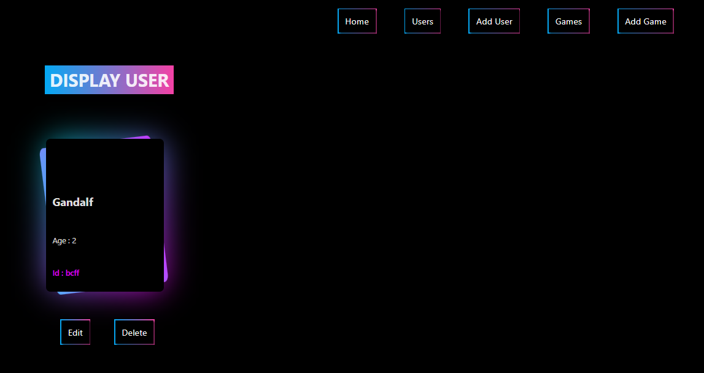
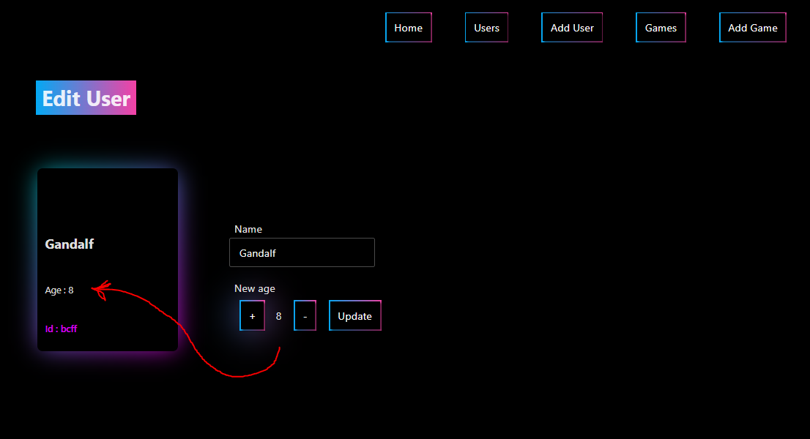

# React + Vite project

### Setup
- `npm install`
- This will create `node_modules` folder with all dependencies
- No activation of any environment needed

### Launch front-end API
- `npm run dev`

### Run back-end (SECOND TERMINAL REQUIRED) 
- `npx json-server --watch src/db.json --port 5000`

